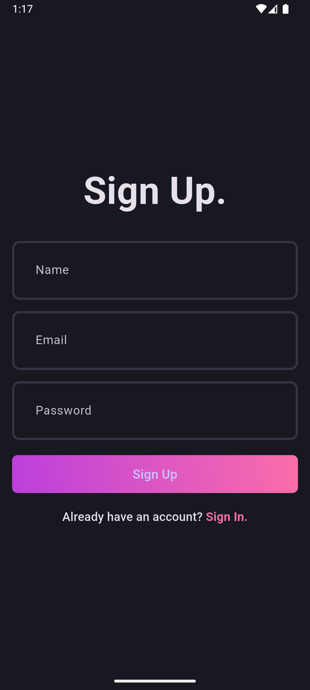
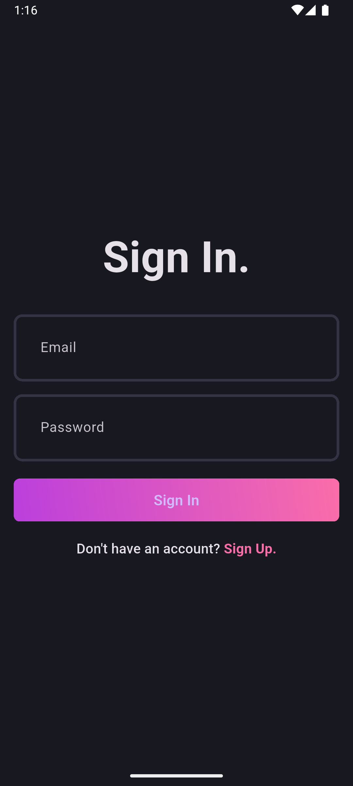
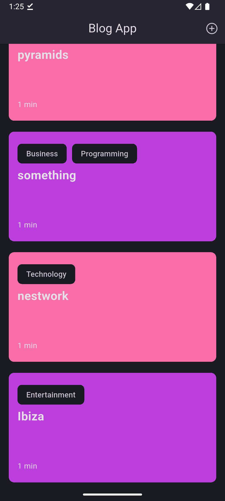
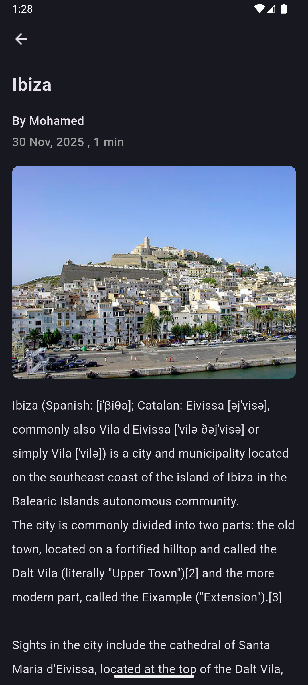
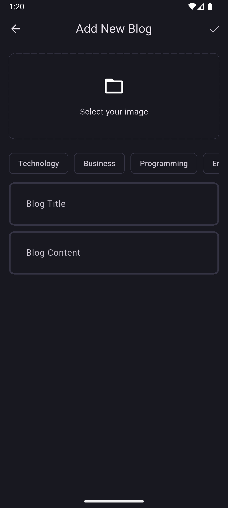
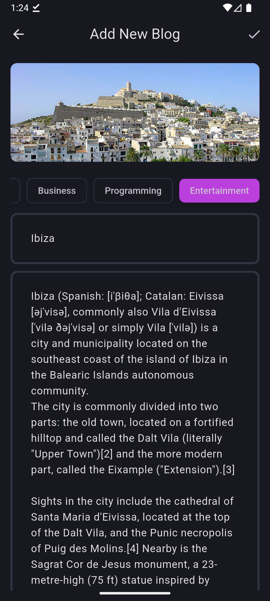
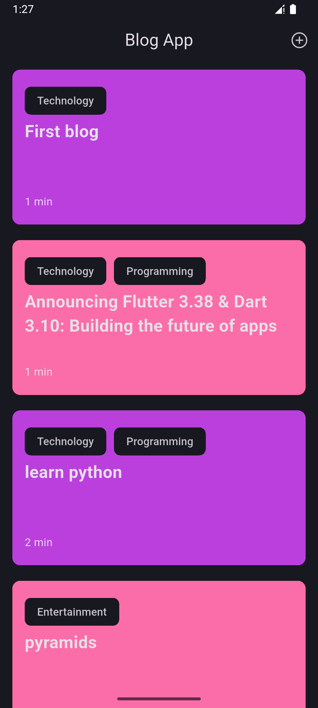

# Blog App

A Simple Blog App to learn Clean Architecture and SOLID principles, designed to demonstrate Clean Architecture principles and offline capabilities.

## Features

- **Authentication**: Secure user sign-up and login using Supabase.
- **Blog Management**:
  - Create new blog posts with images.
  - View a feed of all blog posts.
  - View detailed blog posts.
- **Offline Support**: Access previously loaded blogs even without an internet connection (using Hive).
- **Clean Architecture**: Separation of concerns into Domain, Data, and Presentation layers.
- **State Management**: Powered by `flutter_bloc`.
- **Functional Programming**: Utilizes `fpdart` for robust error handling.

## Tech Stack

- **Framework**: Flutter
- **Language**: Dart
- **Backend**: Supabase
- **State Management**: flutter_bloc
- **Dependency Injection**: get_it
- **Local Storage**: Hive
- **Functional Programming**: fpdart
- **Networking**: internet_connection_checker_plus

## Getting Started

### Prerequisites

- Flutter SDK
- A Supabase project (URL and Anon Key)

### Installation

1.  **Clone the repository**

    ```bash
    git clone https://github.com/mhmaldyb510/blog-app.git
    cd blog-app
    ```

2.  **Install dependencies**

    ```bash
    flutter pub get
    ```

3.  **Environment Setup**

    This project uses an `AppSecrets` class to manage sensitive keys.
    Create a file named `app_secrets.dart` in `lib/core/secret/`:

    ```dart
    class AppSecrets {
      static const supabaseUrl = 'YOUR_SUPABASE_URL';
      static const supabaseAnonKey = 'YOUR_SUPABASE_ANON_KEY';
    }
    ```

4.  **Run the App**

    ```bash
    flutter run
    ```

## Folder Structure

The project is organized as follows:

```
lib/
├── core/                   # Core functionality (errors, network, themes, utils)
├── features/               # Feature-based modules
│   ├── auth/               # Authentication feature
│   │   ├── data/           # Data layer (repositories, sources)
│   │   ├── domain/         # Domain layer (entities, usecases, repo interfaces)
│   │   └── presentation/   # Presentation layer (blocs, pages, widgets)
│   └── blog/               # Blog management feature
│       ├── data/
│       ├── domain/
│       └── presentation/
├── init_dependencies.dart  # Dependency injection setup (GetIt)
└── main.dart               # Application entry point
```

## Architecture

This project follows **Clean Architecture**:

- **Domain Layer**: Entities, Use Cases, Repository Interfaces (Pure Dart, no Flutter dependencies).
- **Data Layer**: Models, Data Sources (Remote/Local), Repository Implementations.
- **Presentation Layer**: BLoCs, Pages, Widgets.

## Screenshots

<table>
  <tr>
    <td></td>
    <td></td>
  </tr>
  <tr>
    <td></td>
    <td></td>
  </tr>
  <tr>
    <td></td>
    <td></td>
  </tr>
  <tr>
    <td colspan="2" align="center"></td>
  </tr>
</table>

---
